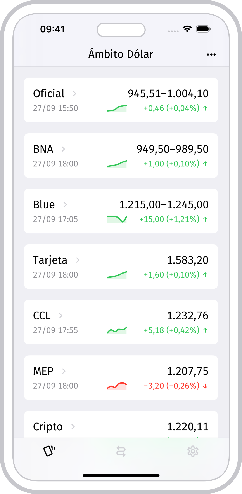

# Ámbito Dólar 💸

[](https://github.com/outaTiME/ambito-dolar/actions/workflows/main.yml)
&nbsp;
[](https://creativecommons.org/licenses/by-nc-nd/4.0)
&nbsp;
[](https://twitter.com/outa7iME)

> A free and open-source mobile application to follow the different quotes of the USD in Argentina.

## Preview

<div>
  
  &nbsp;
  
</div>

## Download

<div>
  <a href="https://apps.apple.com/app/id1485120819">
    
  </a>
  &nbsp;
  <a href="https://play.google.com/store/apps/details?id=im.outa.AmbitoDolar">
    
  </a>
</div>

## Install

```sh
yarn install
```

## Run tests

```sh
yarn run test
```

## Contributing

Contributions, issues and feature requests are welcome!

Feel free to check [issues page](https://github.com/outaTiME/ambito-dolar/issues).

## Show your support

Give a ⭐️ if this project helped you!

## License

Copyright © [outaTiME](https://outa.im)

This project is [CC-BY-NC-ND-4.0](https://creativecommons.org/licenses/by-nc-nd/4.0) licensed.
